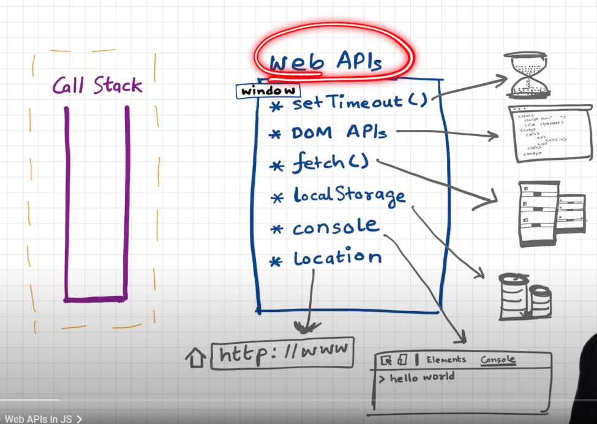
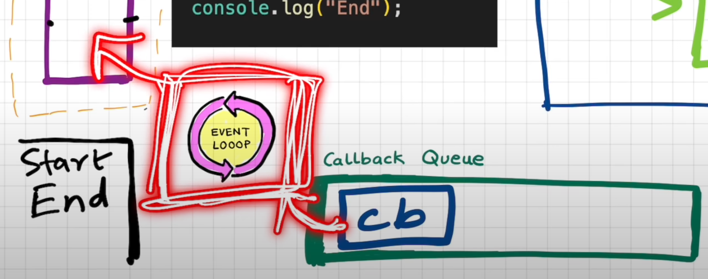

# The Event Loop

JavaScript is a single-threaded synchronous language - that means it can perform a single task at at time and that too in a particular order.

But then how does JS manage to perform asynchronous functions like `setTimeout` and others?

## An Example 🧪

Let's understand through a `setTimeout` example:

```js
console.log("start");

setTimeout(function callback() {
  console.log("this is callback function");
}, 5000);

console.log("end");
```

As it might have been obvious from the previous articles, the result in the console looks something like this:

```
start
end
this is callback function
```

Yes, JS doesn't wait for `setTimeout` to finish executing before moving on to the next line.

But then, what is it doing behind the scene?

For that we need to understand how browsers work and what are Web APIs.

Browsers are basically a culmination of multiple complex parts and mechanisms.

A typical browser consists of a JavaScript engine(like v8, SpiderMonkey, JavaScriptCore etc.) and a huge set of other things like local storage, timer, rendering engine, bluetooth access, geolocation access etc. These features of the browsers can be accessed by a developer using **Web APIs**. These APIs are not part of JavaScript by any means, rather a way to interact with the browser environment.



`setTimeout` is one such Web API - yes, it's not part of JavaScript at all 😯

When we call `setTimeout`, the function gets into the callstack for sure - but then the API tells the in-built browser timer to start a timer for 5 seconds and then produce the `callback` function - so `setTimeout` gets out of the callstack just by doing this and the next line of code enters the call stack for execution.

But, after 5 seconds have passed, what happens to this `callback`?

The `callback` enters the **_Callback Queue_** - waiting to be executed.

But how does it enter the call stack for execution?

Here comes our mighty **_Event Loop_** 🥁

The Event looks constantly checks between the Call Stack and the Callback Queue. When the Call Stack is empty and it transfers the `callback` function from the Callback Queue to the Call Stack for execution - and finally, `callback` gets executed!👏🏻


This same process applies for Event Listeners, instead of the timer, it uses the DOM API to keep track of whether the user have clicked(or any available action) a particular DOM element and then dispatches a callback to the Callback Queue for exexution.

## `fetch()` and the MicroTasks Queue

Let's see an example:

```js
console.log("start");

fetch("https://api.netflix.com").then(function callBack() {
  console.log("Netflix API worked 🤝🏻");
});

console.log("end");
```

Here `fetch` works a bit differently than event listeners. The `fetch` API returns a promise upon completion/failure. When `fetch()` enters the Call Stack, it just registers the call back function `callBack` to be called when the promise returns something and then the JS engine moves on to the next line of code.

When the `fetch` API returns the response from Netflix servers, then it dispatches `callBack` - but this time NOT to the Callback Queue, rather to the **_MicroTasks Queue_**.

The MicroTask Queue and the Callback Queue - both are looked after by the Event Loop, which tracks changes in them and inserts the callback functions to the Call Stack when necessary.

> However, **_MicroTask Queue is superior in priority to the Callback Queue_** - this means the Event Loop first finsihes passing all the functions in the MicroTask Queue to the Call Stack before looking into the Callback Queue.

## Starvation of Functions in the Callback Queue 😭

If a callback in the MicroTask Queue create more callbacks - then the Event Loop keeps executing more callbacks from the MTQ and the callbacks in the CQ get stuck - this is called Starvation of Function in the CQ.
