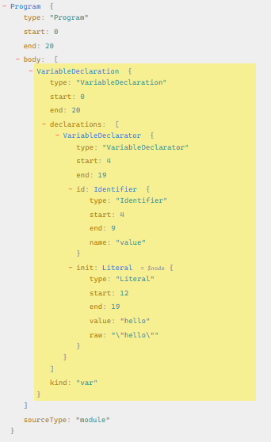

# ⚙️ The JavaScript Engine

JavaScrip Engine is the program that is in-charge of executing JavaScript code. When JavaScript first came into existence it was only meant to be used inside the browser. But today, we see JavaScript running in all sorts of places even outside the browser - including servers, machines etc. And hence, JavaScript Engine has to be present in all of these too.

## 🤔 JSRE

The JavaScript Engine along with several other components like the Event Loop, the Callback Queue, the MicroTask Queue - is called the JSRE or the JavaScript Runtime Environment.

## 💅🏻 Different JS Engines

As JS has to be run in different devices and environments, there are several JS engines that do these jobs. Different browsers have different JS engines.

- The Internet Explorer and Microsoft Edge used to have the **_Chakra_** engine.
- **_SpiderMonkey_** is used in Mozilla Firefox
- Safari uses **_JavaScriptCore_**
- Most modern browsers like Chrome, MSEdge, Brave, Opera and even server-side JSREs like NodeJS, Deno use Google's **_v8_** engine.

## 🏗️ JS Engine Architecure

Different JavaScript Engines have different implementations and different set of features, but we can still generalize all JS engines for the sake of simplicity and getting an idea of their general architecture.

## 🌊 Overall flow

```
Code -> Parsing -> Compilation -> Execution
```

## ▶️ Parsing

Here the code gets broken down into tokens and the **Syntax Parser** converts your code into the Abstract Syntax Tree or the **_AST_**.

## What the heck is an AST?

Here is a piece of JS code:

```js
var value = "hello";
```

Here is how the AST for this looks like:



> Source: https://astexplorer.net/

## ▶️ Compilation

The AST generatered in the Parsing stage is passed onto for compilation.

### 🤔 Interpreter vs Compiler

An **interpreter** goes through and executed the code line by line. It doesn't have any idea about code next to the one its executing.

A **compiler**, on the other hand, converts your code into an optimized version of itself, and then executes the code.

Interpreter is by nature faster than a compiler.

### 🧐 Is JavaScript an interpreted or compiled language?

Well, none of them.

> JavaScript uses the best of both worlds and uses something called as **_Just In-time Compilation_** or **_JIT Compilation_**.
