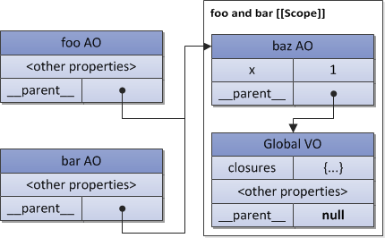

# Closure

In ECMAScript, functions are the first-class objects. This term means that functions may be passed as arguments to other functions (in such case they are called _“funargs”_, short from “functional arguments”). Functions which receive “funargs” are called higher-order functions or, closer to mathematics, _operators_. Also functions may be returned from other functions. Functions which return other functions are called _function valued functions_ (or functions with _functional value_).

## The Funarg Problems

There are two conceptual problems related with _“funargs”_ and _“functional values”_. And these two sub-problems are generalized in one which is called a _“Funarg problem”_ (or _“A problem of a functional argument”_). And exactly to solve the complete “funarg problem”, the concept of closures was invented. Let’s describe in more detail these two sub-problems (we’ll see that both of them are solved in ECMAScript using a mentioned on figures `[[Scope]]` property of a function).

## Upward Funarg Problem

First subtype of the _“funarg problem”_ is an _“upward funarg problem”_. It appears when a function is returned “up” (to the outside) from another function and uses already mentioned above _free variables_. To be able access variables of the parent context even after the parent context ends, the inner function at creation moment saves in it’s `[[Scope]]` property parent’s scope chain. Then when the function is activated, the scope chain of its context is formed as combination of the _activation object_ and this `[[Scope]]` property (actually, what we’ve just seen above on figures):

```
Scope chain = Activation object + [[Scope]]
```

Notice again the main thing — exactly at creation moment — a function saves parent’s scope chain, because exactly this saved scope chain will be used for variables lookup then in further calls of the function.

```js
function foo() {
  var x = 10;
  return function bar() {
    console.log(x);
  };
}

// "foo" returns also a function
// and this returned function uses
// free variable "x"

var returnedFunction = foo();

// global variable "x"
var x = 20;

// execution of the returned function
returnedFunction(); // 10, but not 20
```

This style of scope is called the _static_ (or _lexical_) scope. We see that the variable `x` is found in the saved `[[Scope]]` of returned `bar` function. In general theory, there is also a _dynamic scope_ when the variable `x` in the example above would be resolved as `20`, but not `10`. However, dynamic scope is not used in ECMAScript.

## Downward Funarg Problem

The second part of the “funarg problem” is a “downward funarg problem”. In this case a parent context may exist, but may be an ambiguity with resolving an identifier. **_The problem is: from which scope a value of an identifier should be used — statically saved at a function’s creation or dynamically formed at execution (i.e. a scope of a caller)?_** To avoid this ambiguity and to form a closure, a static scope is decided to be used:

```js
/ global "x"
var x = 10;

// global function
function foo() {
  console.log(x);
}

(function (funArg) {

  // local "x"
  var x = 20;

  // there is no ambiguity,
  // because we use global "x",
  // which was statically saved in
  // [[Scope]] of the "foo" function,
  // but not the "x" of the caller's scope,
  // which activates the "funArg"

  funArg(); // 10, but not 20

})(foo); // pass "down" foo as a "funarg"
```

**We may conclude that a static scope is an _obligatory_ requirement to have closures in a language.** However, some languages may provide combination of dynamic and static scopes, allowing a programmer to choose — what to closure and what do not. Since in ECMAScript only a static scope is used (i.e. we have solutions for both subtypes of the “funarg problem”), the conclusion is: ECMAScript has complete support of closures, which technically are implemented using `[[Scope]]` property of functions. Now we may give a correct definition of a closure:

> **A _closure_ is a combination of a code block (in ECMAScript this is a function) and statically/lexically saved all parent scopes. Thus, via these saved scopes a function may easily refer free variables.**

Notice, that since every (normal) function saves `[[Scope]]` at creation, theoretically, all functions in ECMAScript are closures.

Another important thing to note, that several functions may have the same parent scope (it’s quite a normal situation when e.g. we have two inner/global functions). In this case variables stored in the `[[Scope]]` property are shared between all functions having the same parent scope chain. Changes of variables made by one closure are _reflected_ on reading these variables in another closure:

```js
function baz() {
  var x = 1;
  return {
    foo: function foo() {
      return ++x;
    },
    bar: function bar() {
      return --x;
    },
  };
}

var closures = baz();

console.log(
  closures.foo(), // 2
  closures.bar() // 1
);
```

This code may be illustrated with the following figure:


