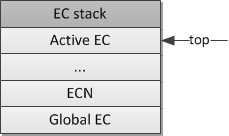
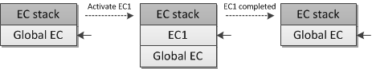
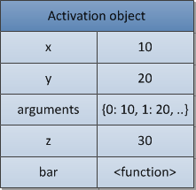

> JavaScript is a **_synchronous single-threaded_** language.
> Synchronous Single-threaded: JS can only process one command at a time, and that too in a specific order.

# Execution Context Stack

There are three types of ECMAScript code: _global_ code, _function_ code and _eval_ code. Every code is evaluated in its execution context. There is only one global context and may be many instances of function and eval execution contexts. Every call of a function, enters the function execution context and evaluates the function code type. Every call of `eval` function, enters the eval execution context and evaluates its code.

Notice, that one function may generate infinite set of contexts, because every call to a function (even if the function calls itself recursively) produces a new context with a new context state:

```js
function foo(bar) {}

// call the same function,
// generate three different
// contexts in each call, with
// different context state (e.g. value
// of the "bar" argument)

foo(10);
foo(20);
foo(30);
```

An execution context may activate another context, e.g. a function calls another function (or the global context calls a global function), and so on. Logically, this is implemented as a stack, which is called the execution context stack.

> Execution Context Stack = Call Stack = Program Stack = Control Stack = Runtime Stack = Machine Stack

A context which activates another context is called a caller. A context is being activated is called a callee. A callee at the same time may be a _caller_ of some other _callee_ (e.g. a function called from the global context, calls then some inner function).

When a caller activates (calls) a callee, the caller suspends its execution and passes the control flow to the callee. The callee is pushed onto the the stack and is becoming a _running (active)_ execution context. After the callee’s context ends, it returns control to the caller, and the evaluation of the caller’s context proceeds (it may activate then other contexts) till the its end, and so on. A callee may simply _return_ or _exit with an exception_. A thrown but not caught exception may exit (pop from the stack) one or more contexts.

i.e. all the ECMAScript program runtime is presented as the execution context (EC) stack, where top of this stack is an active context:



When program begins it enters the global execution context, which is the _bottom_ and the _first_ element of the stack. Then the global code provides some initialization, creates needed objects and functions. During the execution of the global context, its code may activate some other (already created) function, which will enter their execution contexts, pushing new elements onto the stack, and so on. After the initialization is done, the runtime system is waiting for some event (e.g. user’s mouse click) which will activate some function and which will enter a new execution context.

In the next figure, having some function context as `EC1` and the global context as `Global EC`, we have the following stack modification on entering and exiting `EC1` from the global context:



This is exactly how the runtime system of ECMAScript manages the execution of a code.

As we said, every execution context in the stack may be presented as an object. Let's see on its structure and what kind of _state_(which properties) a context is needed to execute its code.

# Execution Context

An execution context abstractly may be represented as a simple object. Every execution context has set of properties (which we may call a context’s state) necessary to track the execution progress of its associated code. In the next figure a structure of a context is shown:


Besides these three needed properties(a _variable object_, a `this` _value_ and a _scope chain_), an execution context may have additional state depending upon implementation.

Let's consider these important properties of a context in detail.

## Variable Object

> A _variable object_ is a container of _data_ associated with the execution context. It's a special object that stores _variables_ and _function declarations_ defined in the context.

Notice, that _function exoressions_ (in contrast with _function declarations_) are _not included_ into the variable object.

A variable object is an abstract concept. In different context types, physically, it's presented using different object. For example, in the global context the variable object is the _global object itself_(that's why we have an ability to refer global variables via property names of the global object).

Let's consider the following execution context:

```js
var foo = 10;

function bar() {} // function declaration, FD
(function baz() {}); // function expression, FE

console.log(
  this.foo == foo, // true
  window.bar == bar // true
);

console.log(baz); // ReferenceError, "baz" is not defined
```

Then the global context's variable object(VO) will have the following properties:


See again, that function `baz` being a function expression is not included into the variable object. That’s why we have a `ReferenceError` when trying to access it outside the function itself.

Notice, that in contrast with other languages (e.g. C/C++) in ECMAScript only functions create a new scope. Variables and inner functions defined within a scope of a function are not visible directly outside and do not pollute the global variable object.

And what about functions and their variable objects? In a function context, a variable object is presented as an _activation object_.

## Activation Object

When a function is activated(called) by the caller, a special object called the activation object is created. It's filled with formal parameters and the special `arguments` object(which is a map of formal parameters but with index-properties). The activation object is then used as a _variable object_ of the function context.

> I.e. a function’s variable object is the same simple variable object, but besides variables and function declarations, it also stores formal parameters and `arguments` object and called the activation object.

Consider the following example:

```js
function foo(x, y) {
  var z = 30;
  function bar() {} //FD
  (function baz() {}); //FE
}

foo(10, 20);
```

We have the next activation object(AO) of the `foo` function context:



And again the function expression `baz` is not included into the variable/activate object.

> Notice, in ES5 the concepts of variable object, and activation object are combined into the **lexical environments model**.

### Additional Resources

###### 📺 Videos:

- [How JavaScript Code is executed & Call Stack ](https://www.youtube.com/watch?v=iLWTnMzWtj4&list=PLlasXeu85E9cQ32gLCvAvr9vNaUccPVNP&index=3&ab_channel=AkshaySaini)

- [How JavaScript Works & Execution Context](https://www.youtube.com/watch?v=ZvbzSrg0afE&list=PLlasXeu85E9cQ32gLCvAvr9vNaUccPVNP&index=3&ab_channel=AkshaySaini)

- [Demo of Call Stack in the Browser](https://youtu.be/Fnlnw8uY6jo?t=852)
