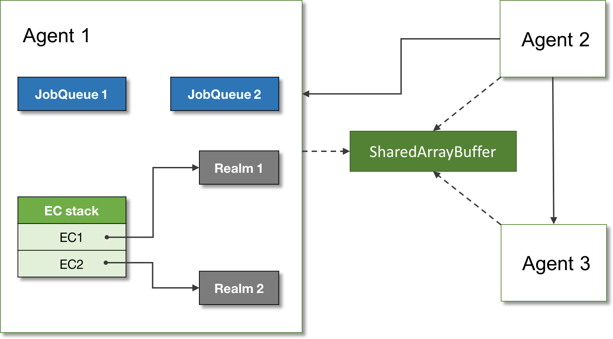

# Agent 
The concurrency and parallelism is implemented in ECMAScript using Agent pattern. The Agent pattern is close to the 
Actor pattern - a lightweight process with message-passing style of communication.  

> **Agent**: An agent is an abstraction encapsulating execution context stack, set of job queues, and code realms.

Depending on implementation, an agent can run in the same thread, or on a separate thread, The `Worker` agent in the browser environment is an example of the _Agent_ concept.

The agents are _state isolated_ from each other, and can communicate by sending messages. Some data can be shared though between agents, for example `SharedArrayBuffers`. Agents can also combine into _agent clusters_.

In the example below, the `index.html` calls the `agent-smith.js` worker, passing shared chunk of memory:

```js
// In the `index.html`:
 
// Shared data between this agent, and another worker.
let sharedHeap = new SharedArrayBuffer(16);
 
// Our view of the data.
let heapArray = new Int32Array(sharedHeap);
 
// Create a new agent (worker).
let agentSmith = new Worker('agent-smith.js');
 
agentSmith.onmessage = (message) => {
  // Agent sends the index of the data it modified.
  let modifiedIndex = message.data;
 
  // Check the data is modified:
  console.log(heapArray[modifiedIndex]); // 100
};
 
// Send the shared data to the agent.
agentSmith.postMessage(sharedHeap);
```
And the worker code:

```js
// agent-smith.js
 
/**
 * Receive shared array buffer in this worker.
 */
onmessage = (message) => {
  // Worker's view of the shared data.
  let heapArray = new Int32Array(message.data);
 
  let indexToModify = 1;
  heapArray[indexToModify] = 100;
 
  // Send the index as a message back.
  postMessage(indexToModify);
};
```
So below is the picture of the ECMAScript runtime:



And that is it; that’s what happens under the hood of the ECMAScript engine!

