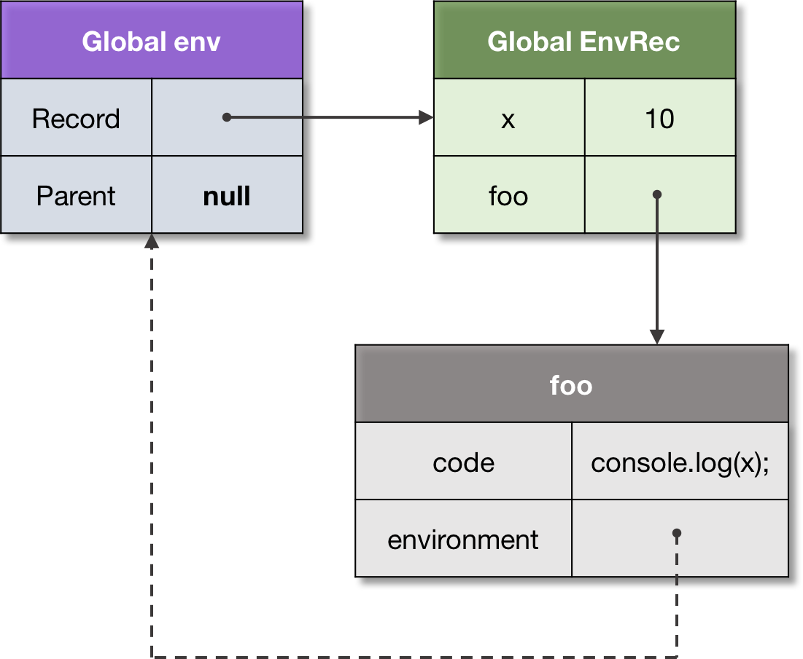
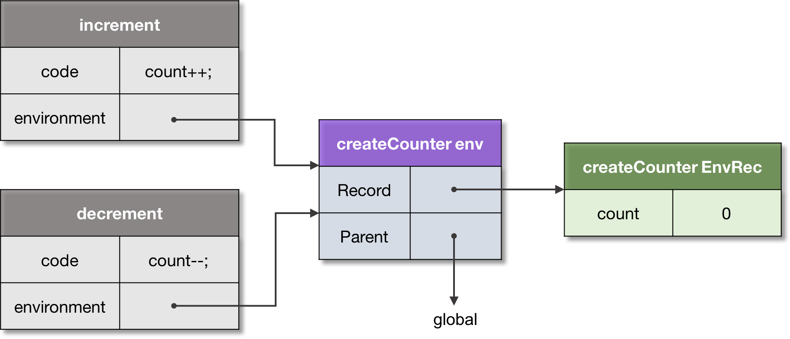

# Closure

Functions in ECMAScript are _first-class_. This concept is fundamental to functional programming, which aspects are
supported in JavaScript.

> **First-class function**: a function which can participate as a normal data: be stored in a variable, passed as an argument, or returned as a value from another function.

With the concept of first-class functions so called _Funarg problem_ is related (or “A problem of a functional
argument”). The problem arises when a function has to deal with free variables.

> **Free variable**: a variable which is neither a parameter, nor a local variable of this function.

Let’s take a look at the Funarg problem, and see how it’s solved in ECMAScript.

Consider the following code snippet:

```js
let x = 10;

function foo() {
    console.log(x);
}

function bar(funArg) {
    let x = 20;
    funArg(); // 10, not 20!
}

// Pass `foo` as an argument to `bar`.
bar(foo);
```

For the function `foo` the variable `x` is free. When the `foo` function is activated (via the `funArg` parameter) —
where should it resolve the `x` binding? From the outer scope where the function was created, or from the caller scope,
from where the function is called? As we see, the caller, that is the `bar` function, also provides the binding for `x`
— with the value `20`.

The use-case described above is known as the **_downwards funarg problem_**, i.e. an ambiguity at determining a correct
environment of a binding: should it be an environment of the creation time, or environment of the call time?

This is solved by an _agreement_ of using _static scope_, that is the scope of the creation time.

> **Static scope**: a language implements static scope, if only by looking at the source code one can determine in which environment a binding is resolved.

The static scope sometimes is also called _lexical scope_, hence the _lexical environments_ naming.

> ⭐ **Technically the static scope is implemented by capturing the environment where a function is created.**

In our example, the environment captured by the foo function, is the global environment:



We can see that an environment references a function, which in turn reference the environment back.

> **Closure**: A closure is a function which captures the environment where it’s defined. Further this environment is used for identifier resolution.

> **Note**: a function is called in a fresh activation environment which stores local variables, and arguments. The parent environment of the activation environment is set to the closured environment of the function, resulting to the lexical scope semantics.

The second subtype of the _Funarg problem_ is known as the **_upwards funarg problem_**. The only difference here is
that _a capturing environment outlives the context which creates it_.

Let's see an example:

```js
function foo() {
    let x = 10;

    // Closure, capturing environment of `foo`.
    function bar() {
        return x;
    }

    // Upward funarg.
    return bar;
}

let x = 20;

// Call to `foo` returns `bar` closure.
let bar = foo();

bar(); // 10, not 20!
```

Again, technically it doesn’t differ from the same exact mechanism of capturing the definition environment. Just in this
case, hadn’t we have the closure, the activation environment of `foo` would be destroyed. But we captured it, so it
cannot be deallocated, and is preserved — to support static scope semantics.

Often there is an incomplete understanding of closures — usually developers think about closures only in terms of the
upward funarg problem (and practically it really makes more sense). However, as we can see, the technical mechanism for
the downwards and upwards funarg problem is exactly the same — and is the mechanism of the static scope.

As we mentioned above, similarly to prototypes, the same parent environment can be shared across several closures. This
allows accessing and mutating the shared data:

```js
function createCounter() {
    let count = 0;

    return {
        increment() {
            count++;
            return count;
        },
        decrement() {
            count--;
            return count;
        },
    };
}

let counter = createCounter();

console.log(
    counter.increment(), // 1
    counter.decrement(), // 0
    counter.increment(), // 1
);
```

Since both closures, increment and decrement, are created within the scope containing the count variable, they share
this parent scope. That is, capturing always happens _“by-reference” _ — meaning the reference to the whole parent
environment is stored.

We can see this on the following picture:



Some languages may capture _by-value_, making a copy of a captured variable, and do not allow changing it in the parent
scopes. However, in JS, to repeat, it is always the reference to the parent scope.

> **Note**: implementations may optimize this step, and do not capture the whole environment. Capturing only used free-variables, they though still maintain invariant of mutable data in parent scopes.

**So all identifiers are statically scoped. There is however one value which is dynamically scoped in ECMAScript. It’s
the value of `this`.**

# `this`

The `this` value is a special object which is _dynamically_ and _implicitly_ passed to the code of a context. We can
consider it as an _implicit extra parameter_, which we can access, but cannot mutate.

The purpose of the `this` value is to execute the same code for multiple objects.

> **This**: an implicit context object accessible from a code of an execution context — in order to apply the same code for multiple objects.

The major use-case is the class-based OOP. An instance method (which is defined on the prototype) exists in one
exemplar, but is shared across all the instances of this class.

```js
class Point {
    constructor(x, y) {
        this._x = x;
        this._y = y;
    }

    getX() {
        return this._x;
    }

    getY() {
        return this._y;
    }
}

let p1 = new Point(1, 2);
let p2 = new Point(3, 4);

// Can access `getX`, and `getY` from
// both instances (they are passed as `this`).

console.log(
    p1.getX(), // 1
    p2.getX(), // 3
);
```

When the `getX` method is activated, a new environment is created to store local variables and parameters. In addition,
function environment record gets the `[[ThisValue]]` passed, which is bound _dynamically_ depending on how a function is
called. When it’s called with `p1`, the `this` value is exactly `p1`, and in the second case it’s `p2`.

Another application of `this`, is _generic interface functions_, which can be used in mixins or traits.

In the following example the `Movable` interface contains generic function `move`, which expects the users of this mixin
to implement `_x` and `_y` properties:

```js
//Generic Movabke interface(mixin)
let Movable = {
    /**
     * This function is generic, and works with any
     * object, which provides `_x`, and `_y` properties,
     * regardless of the class of this object.
     */
    move(x, y) {
        this._x = x;
        this._y = y;
    }
}
let p1 = new Point(1, 2)
//Make p1 movable 
Object.assign(p1, Movable)

//can access the move method 
p1.move(100, 200)

console.log(p1.getX())
```

> Since only by looking at the source code of the function we cannot tell what value of this will it have in a particular call, we say that `this` value is _dynamically scoped_.

The **_arrow functions_** are special in terms of `this` value: their `this` is _lexical(static) but not dynamic_, i.e.
their function environment record _does not provide_ `this` value, and it's taken from the _parent environment_.

```js
var x = 10;

let foo = {
    x: 20,
    //Dynamic this 
    bar() {
        return this.x
    },

    //Lexical this 
    baz: () => this.x,

    qux() {
        //Lexical this within the invocation 
        let arrow = () => this.x

        return arrow()
    }
}

console.log(
    foo.bar(), //20 - from foo 
    foo.baz(), //10, from parent - global 
    foo.qux() //10 - from parent foo 
)
```

Like we said, in the _global context_ the `this` value is the global object(the binding object of the global environment
record). Previously there was only one global object. In current version of the spec there might be multiple global
objects which are part of _code realms_. 

