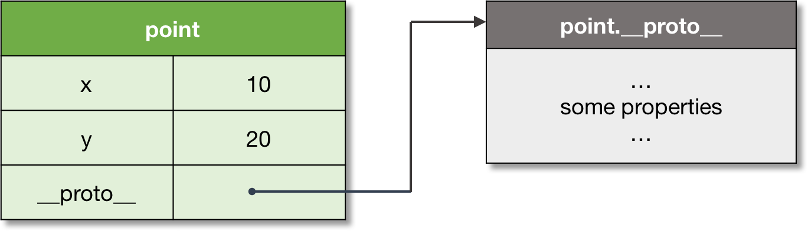

# Object

ECMAScript is an object-oriented programming language with the prototype-based organization, having the concept of an object as its core abstraction.

> **Object**: An object is a collection of properties, and has a single prototype object. The prototype may be either an object or the `null` value.

Let’s take a basic example of an object. A prototype of an object is referenced by the internal `[[Prototype]]` property, which to user-level code is exposed via the `__proto__` property.

For the code:

```js
let point = {
  x: 10,
  y: 20,
};
```

we have the structure with two explicit own properties and one implicit `__proto__` property, which is the reference to the prototype of point:



The prototype objects are used to implement _inheritance_ with the _mechanism of dynamic dispatch_. Let’s consider the prototype chain concept to see this mechanism in detail.
