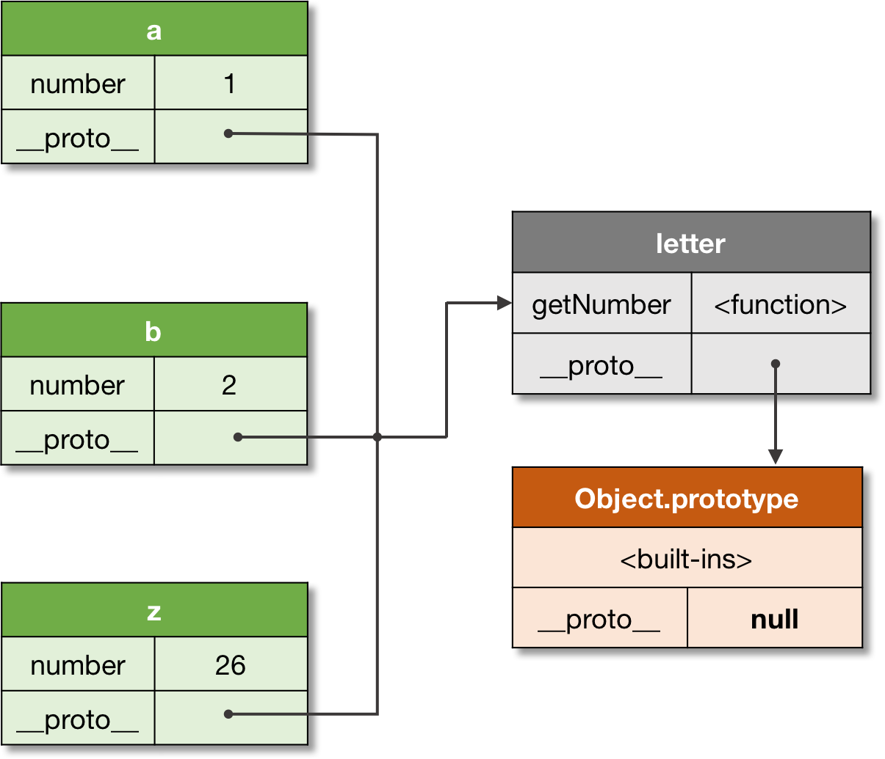

# Prototype

Every object, when is created, receives its prototype. If the prototype is not set explicitly, objects receive default prototype as their inheritance object.

> **Prototype**: A prototype is a delegation object used to implement prototype-based inheritance.

The prototype can be set explicitly via either the `__proto__` property, or Object.create method:

```js
// Base object.
let point = {
  x: 10,
  y: 20,
};

// Inherit from `point` object.
let point3D = {
  z: 30,
  __proto__: point,
};

console.log(
  point3D.x, // 10, inherited
  point3D.y, // 20, inherited
  point3D.z // 30, own
);
```

> **Note**: by default objects receive `Object.prototype` as their inheritance object.

Any object can be used as a prototype of another object, and the prototype itself can have its own prototype. If a prototype has a non-null reference to its prototype, and so on, it is called the prototype chain.

> **Prototype chain**: A prototype chain is a finite chain of objects used to implement inheritance and shared properties.


The rule is very simple: if a property is not found in the object itself, there is an attempt to _resolve_ it in the prototype; in the prototype of the prototype, etc. — until the whole prototype chain is considered.

**Technically this mechanism is known as dynamic dispatch or delegation.**

> **Delegation**: a mechanism used to resolve a property in the inheritance chain. The process happens at runtime, hence is also called **_dynamic dispatch_**.

> **Note**: in contrast with _static dispatch_ when references are resolved at compile time, _dynamic dispatch_ resolves the references at runtime.

And if a property eventually is not found in the prototype chain, the undefined value is returned:

```js
// An "empty" object.
let empty = {};

console.log(
  // function, from default prototype
  empty.toString,

  // undefined
  empty.x
);
```

As we can see, a default object is actually never empty — it always inherits something from the `Object.prototype`. To create a _prototype-less dictionary_, we have to explicitly set its prototype to `null`:

```js
// Doesn't inherit from anything.
let dict = Object.create(null);

console.log(dict.toString); // undefined
```

The dynamic dispatch mechanism allows full mutability of the inheritance chain, providing an ability to change the delegation object:

```js
let protoA = { x: 10 };
let protoB = { x: 20 };

// Same as `let objectC = {__proto__: protoA};`:
let objectC = Object.create(protoA);
console.log(objectC.x); // 10

// Change the delegate:
Object.setPrototypeOf(objectC, protoB);
console.log(objectC.x); // 20
```

> Note: even though the `__proto__` property is standardized today, and is easier to use for explanations, on practice prefer using API methods for prototype manipulations, such as `Object.create`, `Object.getPrototypeOf`,
> `Object.setPrototypeOf`, and similar on the `Reflect` module

On the example of Object.prototype, we see that the same prototype can be shared across multiple objects. On this principle the class-based inheritance is implemented in ECMAScript. Let’s see the example, and look under the hood of the “class” abstraction in JS.

# Class

When several objects share the same initial state and behavior, they form a classification.

> **Class**: A class is a formal abstract set which specifies initial state and behavior of its objects.

In case we need to have _multiple objects_ inheriting from the same prototype, we could of course create this one prototype, and explicitly inherit it from the newly created objects:

```js
// Generic prototype for all letters.
let letter = {
  getNumber() {
    return this.number;
  },
};

let a = { number: 1, __proto__: letter };
let b = { number: 2, __proto__: letter };
// ...
let z = { number: 26, __proto__: letter };

console.log(
  a.getNumber(), // 1
  b.getNumber(), // 2
  z.getNumber() // 26
);
```

We can see these relationships on the following figure:



However, this is obviously cumbersome. And the class abstraction serves exactly this purpose — being a **_syntactic sugar_** (i.e. a construct which _semantically_ does the same, but in a much _nicer syntactic form_), it allows creating such multiple objects with the convenient pattern:

```js
class Letter {
  constructor(number) {
    this.number = number;
  }

  getNumber() {
    return this.number;
  }
}

let a = new Letter(1);
let b = new Letter(2);
// ...
let z = new Letter(26);

console.log(
  a.getNumber(), // 1
  b.getNumber(), // 2
  z.getNumber() // 26
);
```

> **Note**: _class-based_ inheritance in ECMAScript is implemented on top of the _prototype-based delegation_.

> **Note**: a _“class”_ is just a theoretical abstraction. Technically it can be implemented with the _static dispatch_ as in Java or C++, or _dynamic dispatch_ (delegation) as in JavaScript, Python, Ruby, etc.

Technically a “class” is represented as a _“constructor function + prototype”_ pair. Thus, a constructor function creates objects, and also automatically sets the prototype for its newly created instances. This prototype is stored in the `<ConstructorFunction>.prototype` property.

It is possible to use a constructor function explicitly. Moreover, before the class abstraction was introduced, JS developers used to do so not having a better alternative (we can still find a lot of such legacy code allover the internets):

```js
function Letter(number) {
  this.number = number;
}

Letter.prototype.getNumber = function () {
  return this.number;
};

let a = new Letter(1);
let b = new Letter(2);
// ...
let z = new Letter(26);

console.log(
  a.getNumber(), // 1
  b.getNumber(), // 2
  z.getNumber() // 26
);
```

And while creating a single-level constructor was pretty easy, the inheritance pattern from parent classes required much more boilerplate. Currently this boilerplate is hidden as an _implementation detail_, and that exactly what happens under the hood when we create a class in JavaScript.

> **Note**: _constructor functions_ are just _implementation details_ of the class-based inheritance.

Let’s see the relationships of the objects and their class:


The figure above shows that _every object_ has an associated prototype. Even the constructor function (class) Letter has its own prototype, which is `Function.prototype`. Notice, that `Letter.prototype` is the prototype of the Letter instances, that is `a`, `b`, and `z`.

> **Note**: the _actual_ prototype of any object is always the `__proto__` reference. And the explicit prototype property on the constructor function is just a reference to the prototype of its instances; from instances it’s still referred by the `__proto__`.

## Explicit `prototype` and implicit `[[Prototype]]` properties

Often prototype of an object is incorrectly confused with explicit reference to the prototype via the function’s `prototype` property. Yes, really, it references to the same object, as object’s `[[Prototype]]` property:

```
a.[[Prototype]] ----> Prototype <---- A.prototype

```

Moreover, `[[Prototype]]` of an instance gets its value from exactly the `prototype` property of the constructor — at object’s creation.
However, replacing prototype property of the constructor does not affect the prototype of already created objects. It’s only the prototype property of the constructor that is changed! It means that new objects will have a new prototype. But already created objects (before the prototype property was changed), have reference to the old prototype and this reference cannot be changed already:

However, replacing `prototype` property of the constructor _does not affect the prototype of already created objects_. It’s only the `prototype` property of the constructor that is changed! It means that _new objects_ will have a _new prototype_. But already created objects (before the `prototype` property was changed), have reference to the old prototype and this reference cannot be changed already:

```
// was before changing of A.prototype
a.[[Prototype]] ----> Prototype <---- A.prototype

// became after
A.prototype ----> New prototype // new objects will have this prototype
a.[[Prototype]] ----> Prototype // reference to old prototype
```

Example:

```js
function A() {}
A.prototype.x = 10;

var a = new A();
console.log(a.x); // 10

A.prototype = {
  constructor: A,
  x: 20,
  y: 30
};

// object "а" delegates to
// the old prototype via
// implicit [[Prototype]] reference
console.log(a.x); // 10
console.log(a.y) // undefined

var b = new A();

// but new objects at creation
// get reference to new prototype
console.log(b.x); // 20
console.log(b.y) // 30
```

Therefore, sometimes arising statements in articles on JavaScript claiming that _“dynamic changing of the prototype will affect all objects and they will have that new prototype”_ is _incorrect_. New prototype will have _only new_ objects which will be created after this changing.

The main rule here is: the object’s prototype is set at the moment of object’s _creation_ and after that _cannot be changed_ to new object. Using the explicit `prototype` reference from the constructor if it still refers to the _same_ object, it is possible only to add new or modify existing properties of the object’s prototype.
