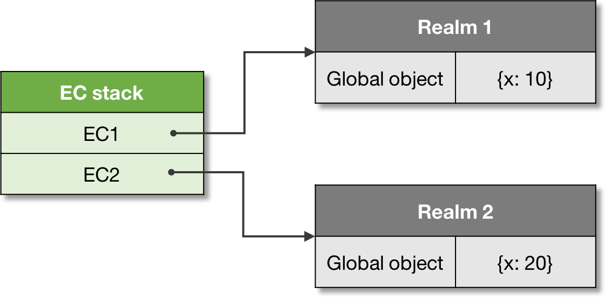

# Realm 

Before it is evaluated, all ECMAScript code must be associated with a _realm_. Technically a realm just provides a global environment for a context.

> **Realm**: A code realm is an object which encapsulates a separate global environment.

When an execution context is created it’s associated with a particular code realm, which provides the global environment for this context. This association further _stays unchanged_.

Current version of the specification doesn’t provide an ability to explicitly create realms, but they can be created implicitly by the implementations. There is a proposal though to expose this API to user-code.

Logically though, each context from the stack is always associated with its realm:



Let’s see the separate realms example, using the `vm` module:

```js
const vm = require('vm');
 
// First realm, and its global:
const realm1 = vm.createContext({x: 10, console});
 
// Second realm, and its global:
const realm2 = vm.createContext({x: 20, console});
 
// Code to execute:
const code = `console.log(x);`;
 
vm.runInContext(code, realm1); // 10
vm.runInContext(code, realm2); // 20
```
Now we’re getting closer to the bigger picture of the ECMAScript runtime. Yet however we still need to see the entry point to the code, and the initialization process. This is managed by the mechanism of _jobs and job queues_.

