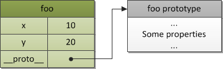

> ECMAScript = European Computer Manufactures' Association Script

## The Object ✨

ECMAScript, being a highly-abstracted object-oriented language, deals with _objects_. There are also _primitives_, but they, when needed, are also converted to objects.

> An object is a collection of properties and has a single _prototype_ object. The prototype may be either an object or the `null` value.

Let’s take a basic example of an object. A prototype of an object is referenced by the internal `[[Prototype]]` property. However, in figures we will use `__<internal-property>__` underscore notation instead of the double brackets, particularly for the prototype object: `__proto__`.

For the code:

```js
var foo = {
  x: 10,
  y: 20,
};
```

we have the structure with _two_ explicit _own_ properties and one implicit `__proto__` property, which is the reference to the prototype of `foo`:



What are these prototypes needed for? Let's consider a _prototype chain_ concept to anser this question.

## A prototype chain ⛓️

Prototype obejcts are also just simple objects and maybe have their own prototypes. If a prototype has a non-null reference to its prototype and so on, this is called the _prototype chain_.

> A prototype is a _finite_ chain of objects which is used to implement _inheritance_ and _shared_ properties.

Consider the case when we have two objects which differ only in some small part and all the other part is the same for both objects. Obviously, for a good designed system, we would like to reuse that similar functionality/code without repeating it in every single object. In class-based systems, this code reuse stylistics is called the class-based inheritance — you put similar functionality into the class `A`, and provide classes `B` and `C` which inherit from `A` and have their own small additional changes.

ECMAScript has no concept of a class. However, code reuse stylistics does not differ much(though, in some aspects even more flexible than class-based) and achieved more via the _prototype chain_. This kind of inheritance is called a _delegation based inheritance_(or, closer to ECMAScript, a _prototype based inheritance_).

Similarly like in the example with classes `A`, `B` and `C`, in ECMAScript you create objects: `a`, `b`, and `c`. Thus, object a stores this common part of both `b` and `c` objects. And `b` and `c` store just their own additional properties or methods.

```js
var a = {
  x: 10,
  calculate: function (z) {
    return this.x + this.y + z;
  },
};

var b = {
  y: 20,
  __proto__: a,
};
var c = {
  y: 30,
  __proto__: a,
};

//call the inherited method:
b.calculate(30); //60
c.calculate(40); //80
```

Easy enough, isn’t it? We see that `b` and `c` have access to the calculate method which is defined in `a` object. And this is achieved exactly via this prototype chain.
